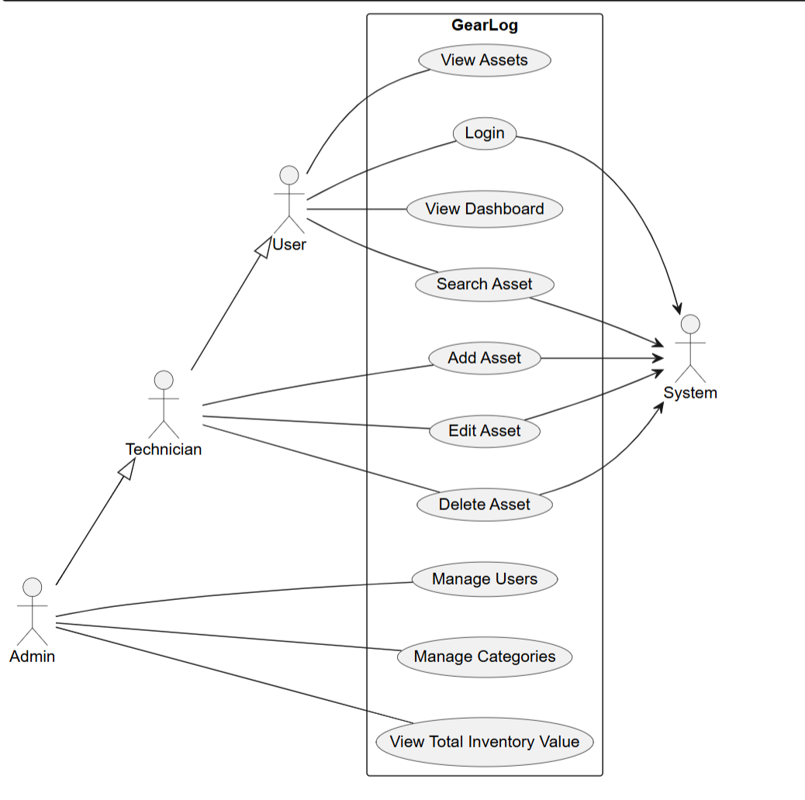
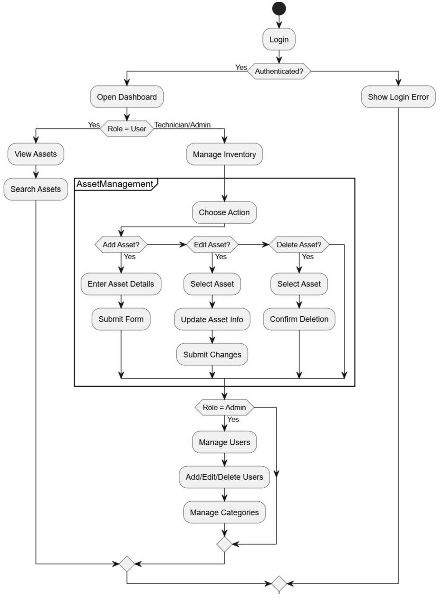
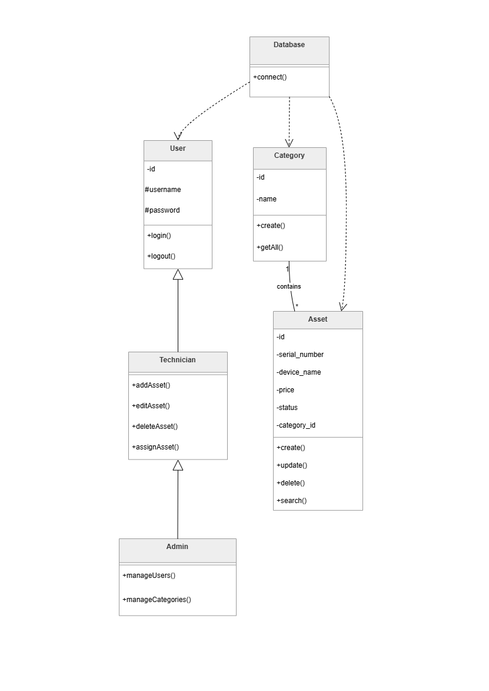
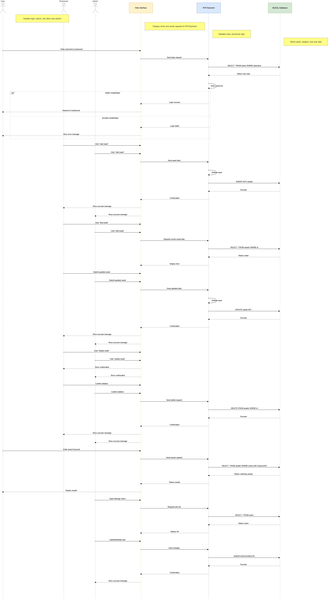

Project Specification: GearLog (IT Asset Tracker)<br>
Launch Date: Wednesday, March 11, 2026 (Afternoon)<br>
Deadline: Wednesday, March 18, 2026 (Morning)<br>
Objective: Develop a web application to track company hardware inventory, assignments, and repair status.<br>

---------------------------------------------------------------------------------------------------------------
# GearLog structure Diagram

---------------------------------------------------------------------------------------------------------------
# GearLog Use Case Diagram

---------------------------------------------------------------------------------------------------------------
# GearLog Activity Diagram

---------------------------------------------------------------------------------------------------------------
# GearLog Class Diagram

---------------------------------------------------------------------------------------------------------------
# GearLog Sequence Diagram

---------------------------------------------------------------------------------------------------------------
# Step 0: Understand the Project
  ## Goal:

Understand the project requirements and identify the main features before starting development.

  ## Topics to learn:

* [X]  Project requirement analysis

* [X]  UI planning

* [X]  Feature breakdown

  ## Learning Resources:

* [X]  [Project Documentation](https://docs.google.com/document/d/1me2bY8Id5YQKZjPOpJWLE_PHmpLzw03KlPiJZ1Vmy4w)

  ## Tasks checklist:

* [X]  Read the full project specification.

* [X]  Identify the main features:

    *   Asset inventory tracking

    *   Category system

    *   Dashboard displaying devices

    *   Search functionality

    *   Inventory value calculation

* [X]  Sketch the UI layout on paper. for example :

```text
+---------------------------------------+
| GearLog Dashboard                     |
| Total Inventory Value: $5400          |
| Search: [________________]            |
+---------------------------------------+
| Serial | Device | Category | Status   |
|---------------------------------------|
| SN123  | Dell   | Laptop   | Repair   |
+---------------------------------------+
```
  ## Expected results:

Clear understanding of the application features and a rough interface design before development begins.

---------------------------------------------------------

# Step 1: Project Setup & Structure
  ## Goal:

Understand the architecture of the GearLog application and organize files properly.

  ## Topics to learn:

* [X]  Web application structure (Frontend vs Backend)

* [X]  PHP project organization

* [X]  File separation (logic vs UI)

* [X]  Local server setup

* [X]  XAMPP usage

* [X]  Apache and MySQL services

  ## Learning Resources:

* [X]  [XAMPP Documentation](https://www.apachefriends.org/docs/)

* [ ]  [MVC Pattern (basic understanding)](https://developer.mozilla.org/en-US/docs/Glossary/MVC)

* [X]  [PHP Project Structure Basics](https://academy.recforge.com/#/course/php-language-mastery-480/level-9-building-a-complete-web-application/setting-up-the-project-structure)

* [X]  [Project structuring for beginners ](https://www.youtube.com/watch?v=CpUov3TSQ9Y)

  ## Tasks checklist:

* [X]  Create project folders (admin, assets, database)

```text
PROJECT_GEAR_LOG/
├── db.php
├── index.php
├── add_asset.php
├── delete_asset.php
├── update_asset.php
├── auth.php
├── login.php
├── logout.php
├── role.php
│
├── admin/
│   └── users.php
│   └── add_user.php
│   └── edit_user.php
│   └── delete_user.php
│
├── assets/
│   └── css/
│       └── style.css
│
└── database/
    └── schema.sql
```

* [X]  Separate CSS into /assets/css

* [X]  Organize PHP files by functionality (auth, db, CRUD)

  ## Expected results:

A clean and maintainable project structure with clearly separated concerns.

# Step 2: Database Design (MySQL)
  ## Goal:

Create a relational database to store assets, categories, and users.

  ## Topics to learn:

* [X]  Relational databases

* [X]  Primary & Foreign Keys

* [X]  ENUM and constraints

  ## Learning Resources:

* [X]  [MySQL documentation](https://www.w3schools.com/mysql/default.asp)

* [X]  [MySQL CREATE TABLE documentation](https://www.mysqltutorial.org/)

* [X]  [Database normalization basics](https://khangnhd.hashnode.dev/mysql-normalization-a-comprehensive-guide)

  ## Tasks checklist:

* [X]  Create database gearlog_db

* [X]  Create categories table

* [X]  Create assets table with:

    *   serial_number (UNIQUE)

    *   price (DECIMAL)

    *   status (ENUM)

    *   category_id (FK)

* [X]  Create User_db table for authentication

  ## Expected results:

A fully functional relational database with linked tables.

# Step 3: Database Connection (PDO)
  ## Goal:

Establish a secure connection between PHP and MySQL.

  ## Topics to learn:

* [X]  PDO (PHP Data Objects)

* [X]  try/catch error handling

* [X]  Connection security

  ## Learning Resources:

* [X]  https://phpdelusions.net/pdo

* [X]  https://www.php.net/manual/en/book.pdo.php

* [X]  [Exception handling in PHP](https://www.php.net/manual/en/class.pdoexception.php)

  ## Tasks checklist:

* [X]  Create db.php

* [X]  Use PDO to connect to database

* [X]  Enable error mode (ERRMODE_EXCEPTION)

* [X]  Handle connection errors with try/catch

  ## Expected results:

Reusable and secure database connection across the project.

# Step 4: Authentication System (Bonus)
  ## Goal:

Restrict access to authorized users only.

  ## Topics to learn:

* [X]  Sessions in PHP

* [X]  Login systems

* [X]  Password hashing

  ## Learning Resources:

* [X]  [PHP sessions guide](https://www.php.net/manual/en/book.session.php)

* [X]  [PHP password_hash() guide](https://www.php.net/manual/en/function.password-hash.php)

* [X]  [PHP password_verify() guide](https://www.php.net/manual/en/function.password-verify.php)

  ## Tasks checklist:

* [X]  Create login system (login.php)

* [X]  Store user in session

* [X]  Protect pages using auth.php

* [X]  Create logout system

  ## Expected results:

Only logged-in users can access the system.

# Step 5: Role-Based Access Control (Bonus)
  ## Goal:

Control what each user can do (Admin, Technician, Guest).

  ## Topics to learn:

* [X]  Role-based authorization

* [X]  Access control logic

  ## Learning Resources:

* [ ]  [RBAC (Role-Based Access Control) basics](https://medium.com/@wwwebadvisor/implementing-role-based-access-control-rbac-in-php-85c0ea7bc86b)

  ## Tasks checklist:

* [X]  Create role.php

* [X]  Define roles:

    *   Admin

    *   Technician

    *   Guest

* [X]  Implement functions:

    *   canEditAssets()

    *   canManageUsers()

  ## Expected results:

Different permissions based on user roles.

# Step 6: Asset Management (CRUD)
  ## Goal:

Allow users to Create, Read, Update, and Delete assets.

  ## Topics to learn:

* [X]  CRUD operations

* [X]  Forms handling in PHP

* [X]  Validation

  ## Learning Resources:

* [X]  [PHP forms handling](https://www.koderhq.com/tutorial/php/form-handling/)

* [X]  [PHP forms tutorial](https://www.php.net/manual/en/tutorial.forms.php)

* [X]  [CRUD operations guide](https://dev.mysql.com/doc/x-devapi-userguide-shell-js/en/devapi-users-crud-operations.html)

  ## Tasks checklist:

* [X]  Create asset (add_asset.php)

* [X]  Update asset (update_asset.php)

* [X]  Delete asset (delete_asset.php)

* [X]  Validate input fields

* [X]  Display errors

  ## Expected results:

Full asset management system working properly.

# Step 7: Secure Data Handling
  ## Goal:

Protect the application from common security vulnerabilities.

  ## Topics to learn:

* [ ]  SQL Injection

* [X]  Prepared statements

* [X]  XSS (Cross-Site Scripting)

* [X]  Data sanitization

* [X]  htmlspecialchars()

  ## Learning Resources:

* [X]  https://phpdelusions.net/pdo/prepared

* [X]  [PDO Prepared statements](https://www.php.net/manual/en/pdo.prepared-statements.php)

* [X]  https://owasp.org/www-community/attacks/xss/

* [X]  [htmlspecialchars](https://www.php.net/manual/en/function.htmlspecialchars.php)

  ## Tasks checklist:

* [X]  Use prepared statements (PDO)

* [X]  Bind parameters to SQL statements

* [X]  Use placeholders in SQL queries

* [X]  Test secure query execution

* [X]  Sanitize outputs using htmlspecialchars()

* [X]  Validate all inputs

  ## Expected results:

A secure application resistant to common attacks.

# Step 8: Dashboard with Relational Data (JOIN)
  ## Goal:

Display assets with their category names.

  ## Topics to learn:

* [X]  SQL JOIN (INNER JOIN)

* [X]  Data relationships

* [X]  PHP loops

* [X]  Dynamic HTML generation

  ## Learning Resources:

* [X]  [PHP documentation](https://www.w3schools.com/php/)

* [X]  [SQL JOIN tutorial](https://dev.mysql.com/doc/refman/8.4/en/join.html)

* [X]  [SQL JOIN documentation](https://www.w3schools.com/sql/sql_join.asp)

  ## Tasks checklist:

* [X]  Use INNER JOIN in index.php

* [X]  Fetch assets from database

* [X]  Replace category_id with category name

* [X]  Display data in HTML table

  ## Expected results:

Readable dashboard with relational data displayed correctly.

# Step 9: Financial Aggregation
  ## Goal:

Calculate total value of all assets.

  ## Topics to learn:

* [X]  SQL aggregate functions

* [X]  SUM()

* [X]  COUNT()

  ## Learning Resources:

* [X]  [SQL aggregate functions documentation](https://dev.mysql.com/doc/refman/8.4/en/aggregate-functions.html)

  ## Tasks checklist:

* [X]  Use SUM(price) COUNT(assets) query

* [X]  Display results at top of dashboard

  ## Expected results:

Total inventory value displayed dynamically.

# Step 10: Search & Filtering
  ## Goal:

Allow users to search and filter assets dynamically.

  ## Topics to learn:

* [X]  SQL LIKE operator

* [X]  Dynamic queries

* [X]  Filtering results

  ## Learning Resources:

* [X]  [SQL LIKE tutorial](https://dev.mysql.com/doc/refman/9.6/en/pattern-matching.html)

* [X]  [http-build-query](https://www.php.net/manual/en/function.http-build-query.php)

  ## Tasks checklist:

* [X]  Add search bar

* [X]  Implement LIKE %...%

* [X]  Filter by name or serial number

* [X]  Add category filtering

  ## Expected results:

Users can quickly find assets.

# Step 11: User Interface (HTML & CSS)
  ## Goal:

Create a clean and usable interface.

  ## Topics to learn:

* [X]  Semantic HTML

* [X]  CSS Flexbox

* [X]  Responsive design

  ## Learning Resources:

* [X]  https://developer.mozilla.org/en-US/docs/Learn/Forms

* [X]  https://www.w3schools.com/html/html_forms.asp

* [X]  [MDN HTML & CSS](https://developer.mozilla.org/en-US/docs/Web/HTML)

* [X]  [Flexbox guide](https://css-tricks.com/snippets/css/a-guide-to-flexbox/)

  ## Tasks checklist:

* [X]  Create a basic HTML form

* [X]  Use <table> for dashboard

* [X]  Use <form> for input

* [X]  Style layout using Flexbox

* [X]  Add toolbar and filters

  ## Expected results:

A clean, organized, and user-friendly interface.

# Step 12: Conditional Styling
  ## Goal:

Visually represent asset status.

  ## Topics to learn:

* [X]  CSS classes

* [X]  Conditional rendering in PHP

  ## Learning Resources:

* [X]  [CSS documentation](https://www.w3schools.com/CSS/)

  ## Tasks checklist:

* [X]  Add colors based on status:

    *   blue    → Deployed

    *   Green   → Available

    *   Orange  → Under Repair

    *   red     → Unavailable

* [X]  Apply classes dynamically

  ## Expected results:

Users can quickly understand asset status visually.

# Step 13: Admin Panel (Bonus)
  ## Goal:

Manage system users.

  ## Topics to learn:

* [X]  Admin dashboards

* [X]  User management systems

  ## Learning Resources:

* [X]  [CRUD operations guide](https://dev.mysql.com/doc/x-devapi-userguide-shell-js/en/devapi-users-crud-operations.html)

  ## Tasks checklist:

* [X]  View users (users.php)

* [X]  Add user

* [X]  Edit user

* [X]  Delete user

* [X]  Restrict access to Admin only

  ## Expected results:

Full user management system.

# Step 14: Advanced Features (Sorting & Pagination)
  ## Goal:

Improve usability of large datasets.

  ## Topics to learn:

* [X]  Sorting in SQL

* [X]  Pagination logic

  ## Learning Resources:

* [X]  [LIMIT & OFFSET in SQL](https://dev.mysql.com/doc/refman/8.4/en/select.html)

* [X]  [http-build-query](https://www.php.net/manual/en/function.http-build-query.php)

  ## Tasks checklist:

* [X]  Implement sorting (ASC/DESC)

* [X]  Secure sorting parameters

* [X]  Add pagination

  ## Expected results:

Efficient navigation through large asset lists.

# Step 15: Final Integration & Testing
  ## Goal:

Ensure the entire system works correctly.

  ## Topics to learn:

* [X]  Debugging

* [X]  Testing web applications

  ## Learning Resources:

* [X]  [PHP debugging techniques](https://www.php.net/manual/en/debugger.php)

  ## Tasks checklist:

* [X]  Test all CRUD operations

* [X]  Test authentication

* [X]  Test role restrictions

* [X]  Test search and filters

* [X]  Fix bugs

  ## Expected results:

A fully functional, stable, and secure GearLog system.

# Step 16: Object-Oriented Programming (OOP) Integration (Bonus)
  ## Goal:

Refactor the procedural PHP code into an Object-Oriented structure for better scalability and maintainability.

  ## Topics to learn:

* [ ]  Classes and Objects in PHP

* [ ]  Encapsulation

* [ ]  Methods and properties

* [ ]  Separation of concerns

  ## Learning Resources:

* [ ]  [PHP OOP Basics (Classes & Objects)](https://www.php.net/manual/en/language.oop5.php)

* [ ]  [PDO with OOP examples](https://phpdelusions.net/pdo)

  ## Tasks checklist:

* [ ]  Create a Database class (handle PDO connection)

* [ ]  Create an Asset class:

    *   addAsset()

    *   updateAsset()

    *   deleteAsset()

    *   getAllAssets()

* [ ]  Create a User class for authentication

* [ ]  Move SQL logic inside class methods

* [ ]  Replace procedural code with class usage

  ## Expected results:

Cleaner, reusable, and modular backend code using OOP principles.

# Step 17: Bootstrap 5 Integration (Bonus)
  ## Goal:

Improve UI design and responsiveness using Bootstrap 5.

  ## Topics to learn:

* [ ]  Bootstrap Grid System

* [ ]  Responsive design

* [ ]  Bootstrap components (Navbar, Table, Forms)

  ## Learning Resources:

* [ ]  [Bootstrap 5 Documentation](https://getbootstrap.com/docs/5.0/getting-started/introduction/)

* [ ]  [Bootstrap CDN usage](https://getbootstrap.com/docs/5.3/getting-started/introduction/)

  ## Tasks checklist:

* [ ]  Add Bootstrap CDN to project

* [ ]  Convert layout to Bootstrap grid

* [ ]  Style forms using Bootstrap classes

* [ ]  Style tables with table, table-striped

* [ ]  Add responsive navbar

* [ ]  Improve mobile display

  ## Expected results:

A modern, responsive, and professional-looking interface.

# Step 18: Authentication Enhancement (Bonus)
  ## Goal:

Improve the security of the authentication system.

  ## Topics to learn:

* [X]  Password hashing (secure storage)

* [X]  Session security

* [X]  Login protection techniques

  ## Learning Resources:

* [X]  [PHP password_hash() guide](https://www.php.net/manual/en/function.password-hash.php)

* [X]  [PHP password_verify() guide](https://www.php.net/manual/en/function.password-verify.php)

* [ ]  [Session security best practices](https://cheatsheetseries.owasp.org/cheatsheets/Session_Management_Cheat_Sheet.html)

  ## Tasks checklist:

* [X]  Ensure passwords are hashed (password_hash)

* [X]  Use password_verify() on login

* [ ]  Add session timeout (auto logout)

* [X]  Prevent session hijacking

* [X]  Add error messages for invalid login

  ## Expected results:

A more secure and professional authentication system.

# Step 19: Advanced Search & Filtering (Enhancement)
  ## Goal:

Enhance search functionality for better usability.

  ## Topics to learn:

* [ ]  Multi-criteria filtering

* [X]  Dynamic SQL queries

* [X]  UX improvements

  ## Learning Resources:

* [X]  [Advanced SQL filtering](https://docs.sqlalchemy.org/en/20/core/sqlelement.html)

  ## Tasks checklist:

* [ ]  Add filtering by:

    *   Status

    *   Category

    *   Price range

* [ ]  Combine filters dynamically

* [ ]  Improve search UI

  ## Expected results:

More powerful and flexible asset filtering.

# Step 20: Reporting & Statistics (Enhancement)
  ## Goal:

Provide insights about inventory through statistics.

  ## Topics to learn:

* [X]  SQL aggregation functions

* [X]  Data visualization basics

  ## Learning Resources:

* [X]  [SQL aggregate functions documentation](https://dev.mysql.com/doc/refman/8.4/en/aggregate-functions.html)

  ## Tasks checklist:

* [X]  Count assets per category

* [ ]  Count assets per status

* [ ]  Display most expensive assets

  ## Expected results:

A dashboard with useful analytics and summaries.

# Step 21: Input Validation & Error Handling Improvement (Enhancement)
  ## Goal:

Make the system more robust against invalid data.

  ## Topics to learn:

* [X]  Server-side validation

* [X]  Error handling strategies

  ## Learning Resources:

* [X]  [PHP validation techniques](https://www.php.net/manual/en/filter.examples.validation.php)

  ## Tasks checklist:

* [X]  Validate:

    *   Empty fields

    *   Price format

    *   Serial number uniqueness

* [X]  Show user-friendly error messages

* [X]  Prevent form resubmission

  ## Expected results:

A more stable and user-friendly application.

# Step 22: Deployment Preparation (future step)
  ## Goal:

Prepare the project for real-world usage.

  ## Topics to learn:

* [ ]  Hosting PHP applications

* [ ]  Database migration

* [ ]  Environment configuration

  ## Learning Resources:

* [ ]  Deploying PHP apps guide

  ## Tasks checklist:

* [ ]  Clean code (remove debug)

* [ ]  Configure production database

* [ ]  Secure credentials

* [ ]  Test on server (localhost → hosting)

  ## Expected results:

A deployable web application ready for real-world use.

-------------------------------------------------------------------

# Final Submission Checklist

* [X]  Database created

* [X]  PDO connection works

* [X]  Assets can be added

* [X]  Dashboard displays assets

* [X]  Category names shown via JOIN

* [X]  Inventory value calculated

* [X]  Search feature works

* [X]  Status colors applied

* [X]  Prepared statements used

* [X]  Outputs sanitized with htmlspecialchars()